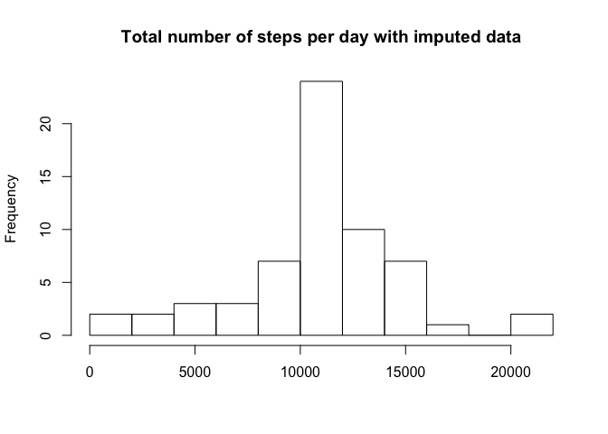

# Reproducible Research: Peer Assessment 1


## Loading and preprocessing the data

Adding columns where the date & time are in POSIX format. 

```r
df <- read.csv("activity.csv")
df <- cbind(df,dateR = strptime(df$date,"%Y-%m-%d"))
df$interval_clock <- strptime(sprintf("%04d", df$interval), format="%H%M")
```

## What is mean total number of steps taken per day?

```r
total_steps <- tapply (df$steps, df$date, sum, na.rm = TRUE)
hist(total_steps, breaks = 10, xlab = "", main = "Total number of steps per day")
```

 


```r
mean_steps <- mean(total_steps)
median_steps <- median(total_steps)
```

The mean total number of steps per day is 9354.23; the median is 10395. 

## What is the average daily activity pattern?
Daily mean by interval is calculated using original, non-POSIX interval notation because tapply requires the index to be a factor. However, daily mean is plotted against POSIX-transformed intervals for readability.

```r
mean_steps_by_interval <- tapply(df$steps,df$interval,mean,na.rm = TRUE)
plot(unique(sort(df$interval_clock)),mean_steps_by_interval, type="l", xlab = "5-min time intervals", ylab = "Number of steps", main = "Average daily activity")
```

 

```r
max_interval <- names(which.max(mean_steps_by_interval))
```

Interval number 835 contains the maximum number of steps, on average across all days.

## Imputing missing values
Get indices of all missing values and create new column for steps with imputed missing values.


```r
idx_na <- which(is.na(df$steps))
df$stepsIMP <- df$steps
```

The total number of missing values is 2304.

Impute missing values using number of steps by interval averaged by day. Store the means of steps by interval in a data frame with rows named according to interval. Use this data frame to look up mean steps by interval.


```r
mean_steps_df <- data.frame(mean_steps_by_interval)
df$stepsIMP[idx_na] <- as.numeric(mean_steps_df[as.character(df$interval[idx_na]),1])
```

The new steps data 


```r
total_stepsIMP <- tapply (df$stepsIMP, df$date, sum, na.rm = TRUE)
hist(total_stepsIMP, breaks = 10, xlab = "", main = "Total number of steps per day with imputed data")
```

 


```r
mean_stepsIMP <- mean(total_stepsIMP)
median_stepsIMP <- median(total_stepsIMP)
```

The mean total number of steps per day is 10766.19; the median is 10766.19. These values are higher than the mean & median for the raw data. Furthermore, the mean and median of the imputed data are equal, while for the raw data, the mean was smaller than the median. Imputing data has made the distribution more normal.

## Are there differences in activity patterns between weekdays and weekends?

Code dates in original dataset as weekday or weekend.

```r
df$day <- weekdays(df$dateR)
weekday <- c("Monday", "Tuesday", "Wednesday", "Thursday", "Friday")
weekend <- c("Saturday","Sunday")
df$day[df$day %in% weekday] <- "weekday"
df$day[df$day %in% weekend] <- "weekend"
df <- transform(df, day = as.factor(day))
```

Calculate average number of steps by weekday/weekend.


```r
AVG_stepsIMP <- vector("numeric", length = length(df$steps))
idx_weekday <- df$day == "weekday"
AVG_stepsIMP[idx_weekday] <- tapply(df$stepsIMP[idx_weekday],df$interval[idx_weekday], mean)
AVG_stepsIMP[!idx_weekday] <- tapply(df$stepsIMP[!idx_weekday],df$interval[!idx_weekday], mean)
df$AVG_stepsIMP <- AVG_stepsIMP
```


```r
library(ggplot2)
library(scales)
ggplot(df, aes(interval_clock, AVG_stepsIMP)) + geom_line() + facet_grid(day ~.) + scale_x_datetime(labels = date_format("%H:%M")) + labs(y = "Average number of steps", x = "5-minute time intervals")
```

 

Activity tends to start earlier on weekdays than on weekends, with a spike around noon that is much more prominent on weekdays (possibly this individual has to walk somewhere to go get lunch, or likes to walk for exercise on his/her lunch break). After noon, activity dies down much more on weekdays than on weekends, where it remains more elevated. On weekdays, we see activity levels die down more abruptly around 11PM than on weekends, where we may see activity until around 1AM.
